# Jobsity Challenge
This document intends to be a brief summary of the project and its goals.
Here, you will find instructions to set up your environment and to run the
application itself.
* The entire solution was made using Ubuntu 20.04 LTS. Some steps may be different
if you are using a different operating system, consult the documentation.
* The project do not focus on security patterns, it is a proof of concept in
data engineering problem.

## Prerequisites
We are going to start assuming that you have the following prerequisites:
1) [Docker](https://docs.docker.com/engine/install/) version: 20.10.16;
2) [Minikube](https://kubernetes.io/docs/tasks/tools/install-minikube/) version: v1.25.2;
3) [Kubectl](https://kubernetes.io/docs/tasks/tools/install-kubectl-linux/) version: v1.24.0;
4) [Krew](https://krew.sigs.k8s.io/docs/user-guide/setup/install/) v0.4.3;
5) [Helm](https://helm.sh/docs/intro/install/) v3.8.2;
7) [Kubens](https://github.com/ahmetb/kubectx) v0.9.4;
8) [Minio](https://github.com/minio/operator/blob/master/README.md#minio-tenant-namespace) v4.4.18
9) Python version: 3.8.10;
10) At least 4 free CPUs;
1At least 8 GB of RAM.

*Almost*

## Steps to init the project
### Minikube
Minikube is a tool for running Kubernetes locally. It will be out container orchestrator.
with it we will be able to run, manage and scale our applications.
1) After installing Minikube, you can start it by running the following command:
```
minikube start --memory=max --cpus=max
```

2) It will be good have a dashboard showing the status of the cluster. For this
purpose, you can run the following command:
```
minikube dashboard
```
Click on the URL displayed in the terminal to access the dashboard.

### Minio
Minio is a distributed object storage system. It is a free and open source.
It has a lot of nice features, worth checking out the documentation. Its architecture
was designed to be resilient to failures and to scale to thousands of objects.

1) Before installing Minio it is necessary to create a 
namespace for it. We can do this by running the following command in you 
terminal:
```
kubectl create namespace minio-tenant-1
```

2) Then we can install Minio by running the following command in your terminal:
```
kubectl krew update
kubectl krew install minio
```

3) After installing, check if everything is working by running the following code:
```
kubectl minio version
```
It should return something like this:
```
v4.4.18
```

4) Now we can run the following command to initialize the Operator:
```
kubectl minio init
```

5) Lets scale down the operator to 1 replica:
```
kubectl scale -n minio-operator deployment minio-operator --replicas=1
```

6) Lets open Operator UI, starting a port forward using this command:
```
kubectl minio proxy -n minio-operator 
```

7) Copy **Current JWT to login hash**, displayed in the terminal after
running the previous command, it will be something like this:

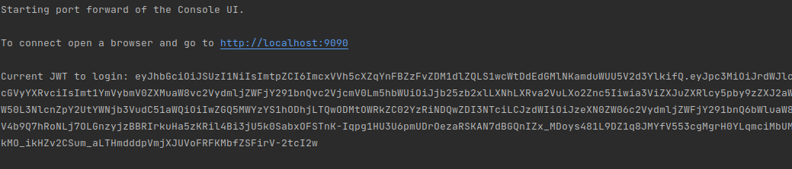

* Open the following URL in your browser: http://localhost:9090/ and paste the
hash you copied in the previous step.
You should see a login page like this bellow:

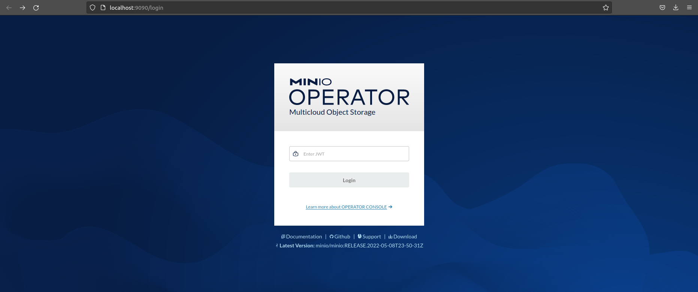

8) Now it is time to create our tenant. We will simplify some security configuration
to make it easier to develop. Click on the **Create Tenant** button, at the top of the
right side of the page:

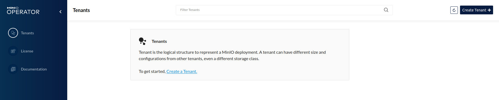

9) In the section **Setup**, fill the following fields (name, namespace and storage
class), as the image shows:

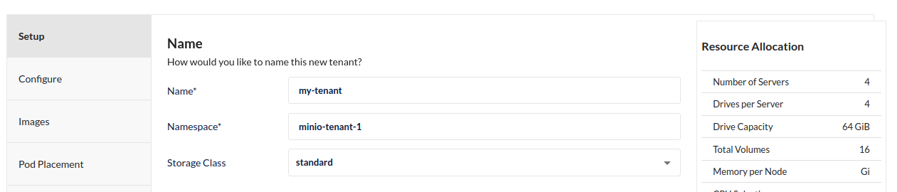

10) In the section **Pod Placement**, select type *None*, as the image shows:

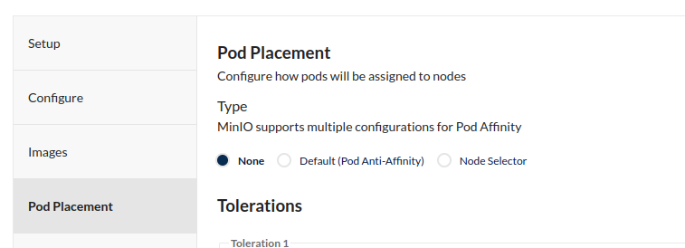

11) In the section **Security**, disable **TLS**:

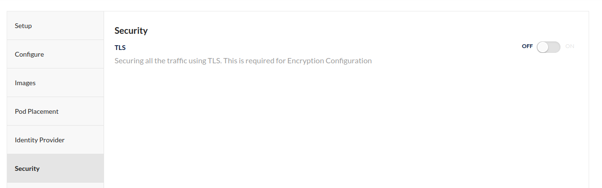

12) Then we can create the tenant by clicking on the **Create Tenant** button.
It will appear a box with your credentials, be sure to save it in a safe place,
it won't be shown again:

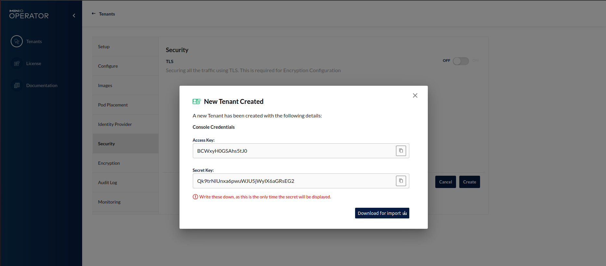

13) After creating a tenant, enter in the details of the tenant and click
on **Console** button on the right side. You should see the following page:

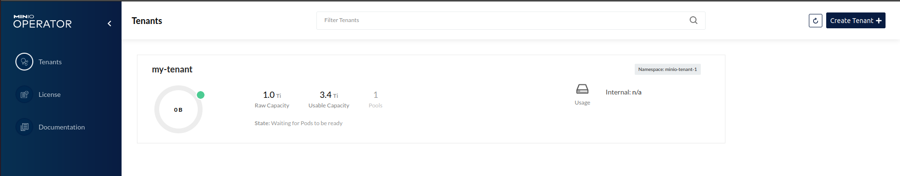

14) Now you can create a new bucket by clicking on the **Create Bucket** button, as you
can see bellow:

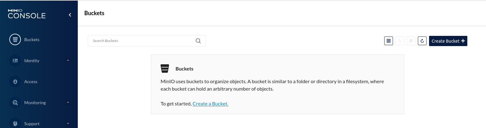

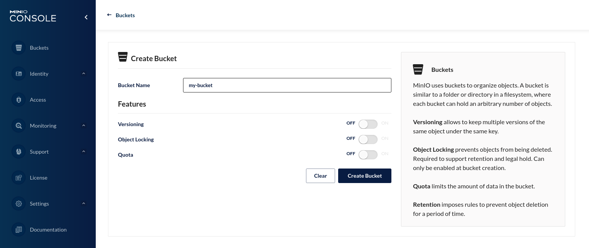

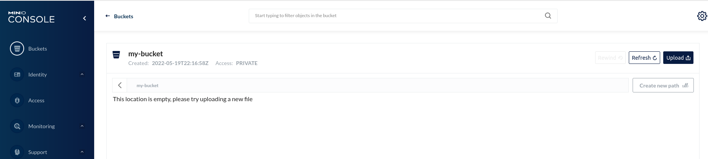

15) Please, upload the reference file to the bucket:

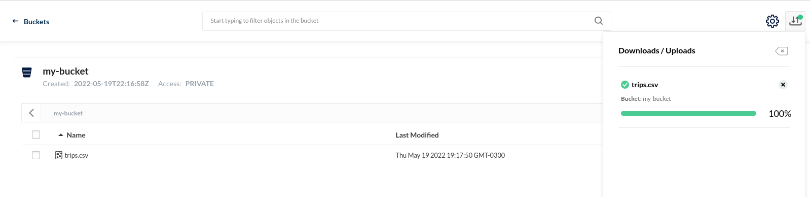

* At this point we already have our Data Lake to work with. Minio is a distributed
storage system, so you can use it to store data in a distributed way. Everything is
done in a Kubernetes ecosystem, using S3(AWS) protocol, so you can use it to store data
the same way you do in the cloud.

16) We have to make the minio port accessible outside the cluster, so we can port-forward
it to the host machine. To do this, we can follow the following steps:

* Chage namespace to minio-tenant-1:
```
kubens minio-tenant-1
```
* Get the service name which port 9000 is associated to, using the following command:
```
kubectl get services
```
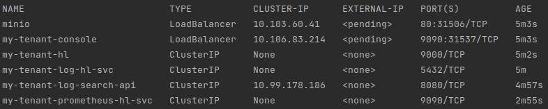

If you filled the tenant name like this tutorial showed, you can run the following:
```
kubectl port-forward service/my-tenant-hl 9000:9000
```

### Spark
1) Before start installing Spark, we need to install Java Development Kit and Java Runtime
Environment. You can install them by running the following command in your terminal:
```
sudo apt-get update
sudo apt-get install openjdk-11-jre openjdk-11-jdk
```
Then we can export JAVA_HOME variable to use it in our environment:
```
export JAVA_HOME=/usr/lib/jvm/java-1.11.0-openjdk-amd64
```

2) Now, we can download Spark binaries at this [link](https://spark.apache.org/downloads.html) and select these specifics:

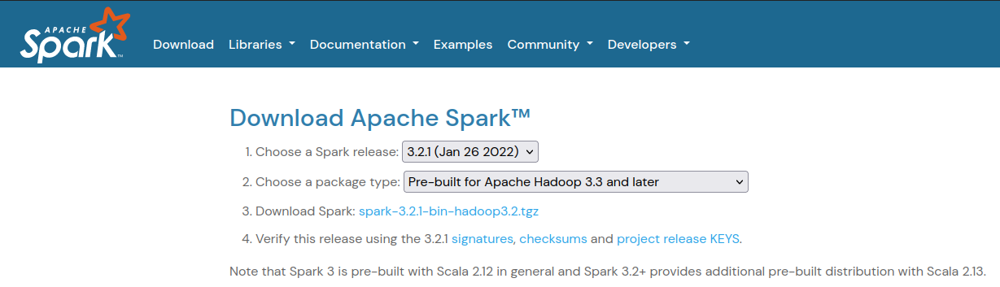

5) Go to the folder where you downloaded the binaries and run the following command:
``` 
sudo tar -xvf spark-3.2.1-bin-hadoop3.2.tgz -C /usr/local/
``` 

4) Lets creat a symbolic link, so we can use it in our terminal:
```
sudo ln -sT /usr/local/spark-3.2.1-bin-hadoop3.2 /usr/local/spark
```

5) Now we have to export the path to the Spark binary in our terminal:
```
export SPARK_HOME=/usr/local/spark
export PATH=$PATH:$SPARK_HOME/bin
```
* At this point you must be able to run *spark-submit* command in your terminal
locally.
* Download these jars and move them into the folder **$SPARK_HOME/jars**.
They are necessary for Spark can work with Minio.
  - [Hadoop-aws 3.2.1](https://repo1.maven.org/maven2/org/apache/hadoop/hadoop-aws/3.2.1/hadoop-aws-3.2.1.jar)
  - [Hadoop-aws 3.3.1](https://repo1.maven.org/maven2/org/apache/hadoop/hadoop-aws/3.3.1/hadoop-aws-3.3.1.jar)
  - [Aws Java Sdk 1.11.901](https://repo1.maven.org/maven2/com/amazonaws/aws-java-sdk-bundle/1.11.901/aws-java-sdk-bundle-1.11.901.jar)

6) Now we have to install the spark-operator. We can do this by running the following command:
```
helm repo add spark-operator https://googlecloudplatform.github.io/spark-on-k8s-operator
helm install my-spark-app spark-operator/spark-operator --namespace spark-operator --create-namespace
```

7) At this point, we have to create our Spark application, but first we need to 
create our docker spark image to set up the environment that will be deployed in kubernetes.
To do that, we can run the following commands:
* Change your docker daemon to use the minikube ones:
```
eval $(minikube docker-env)
```
* Then run the following command to create the image:
```
cd /usr/local/spark
./bin/docker-image-tool.sh -r spark-base -t 1.0.0 -p ./kubernetes/dockerfiles/spark/bindings/python/Dockerfile build
```
* This process may take a while, so please be patient. 

8) Assuming that we already have our spark image, we can now create our Spark application.
First, get back to the project root folder and then:
```
docker build -t spark-base/spark-py:1.0.0 .
```

9) Spark needs a specific login role to be able to access cluster resources.
Lets give him using the following command:
```
kubectl create serviceaccount spark
kubectl create clusterrolebinding spark-role --clusterrole=edit --serviceaccount=default:spark --namespace=spark-operator
```

10) Everythin is ready but we need to pass the credentials to the Spark application.
To do that you have to pass those credential metioned in *Step (12)* of Minio tutorial.
You are going to add it in the **main.py** file, in the parameters of lines 13 and 14, as the
image shows:

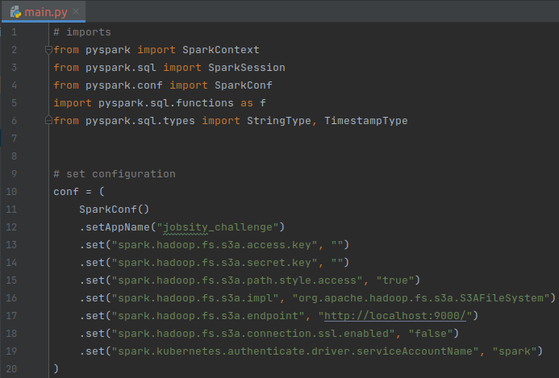

11) Lets deploy our Spark application:
```
kubectl apply -f spark-app.yaml --namespace=spark-operator
```

### Results
After deploying our application, pods will be created in the kubernetes cluster,
execute their jobs and will be destroyed when they finish. The final content in the
bucket will be:

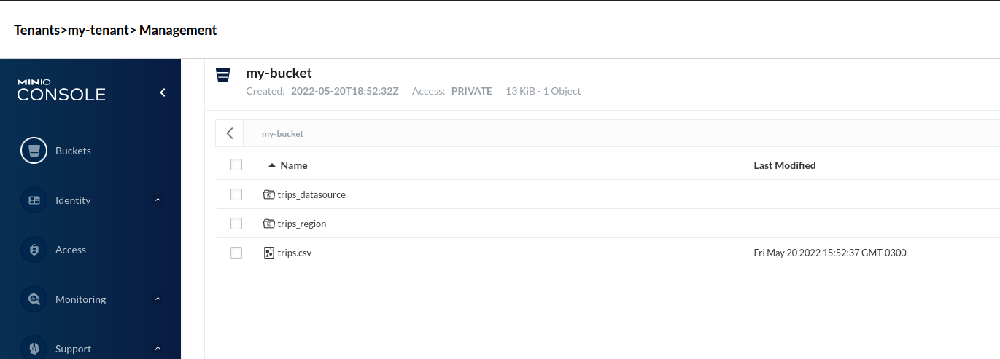

Note that files were writen partitioned by some columns like this:

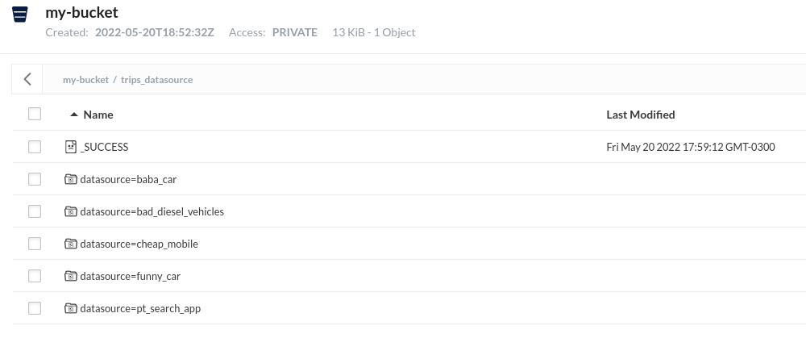
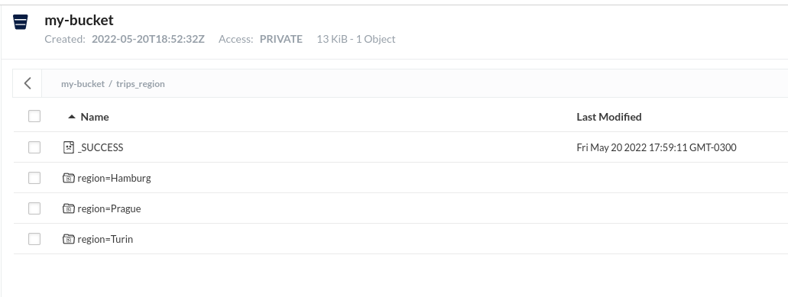

### Considerations
It was a really nice challenge to learn and proof what I could do as a Data Engineer.
I spent a lot of time to build this solution even if it was not the complete solution
required to solve the problem. I hope that I can improve my skills in this area 
continuously, and I will be able to do all the requirements in the future for sure.
I felt really excited about doing it, it was a great experience!

As everyone, I made mistakes, and I won't try to hide it. The following list represents
improvements that I would do if I had more time:
* Integrate Airflow to orchestrate the jobs, my initial idea was to use a sensor that 
would check if the file was edited and then run the spark job.
* Develop layers in the Data Lake (Minio), like: landing, staging, processing, and delivery.
* Integrate a relational database to store the refined data.
* Deal better with connections and configuration files.
* Properly handle secrets and protocols.

Since I already told what I could do better, I will list what I think my solution has
of greatness:
* I focused on documenting all the process and the results, with readable text, commands and images.
* I used a lot of different tools to solve the problem.
* Since it is in a Kubernetes cluster, my solution is entirely scalable, I can scale it to any 
size of cluster.
* It is easy to deploy and manage version of deployments.
* It is portable, I can use it in any environment: cloud or on premisses.


## References
1. [Spark Operator](https://github.com/GoogleCloudPlatform/spark-on-k8s-operator), accessed on [2022-05-17 00:22]
2. [Directpv](https://github.com/minio/directpv), accessed on [2022-05-17 01:55].
3. [Ingress Dns](https://minikube.sigs.k8s.io/docs/handbook/addons/ingress-dns/https://minikube.sigs.k8s.io/docs/handbook/addons/ingress-dns/), accessed on [2022-05-17 13:55].
4. [Resolvconf](https://www.tecmint.com/set-permanent-dns-nameservers-in-ubuntu-debian/), accessed on [2022-05-18 14:36].
5. [Medium](https://medium.com/@leseanbruneau/apache-spark-with-java-setup-4b5350721863), accessed on [2022-05-19 19:38].
6. [Spark](https://spark.apache.org/downloads.html), accessed on [2022-05-19 20:23].
7. [Stack Overflow](https://stackoverflow.com/questions/55498702/how-to-fix-forbiddenconfigured-service-account-doesnt-have-access-with-spark), accessed on [2022-05-20 16:29].